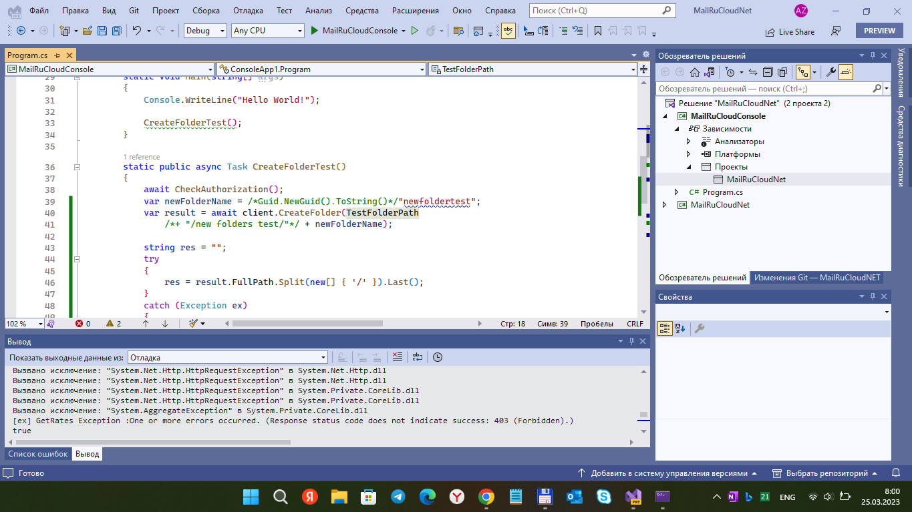
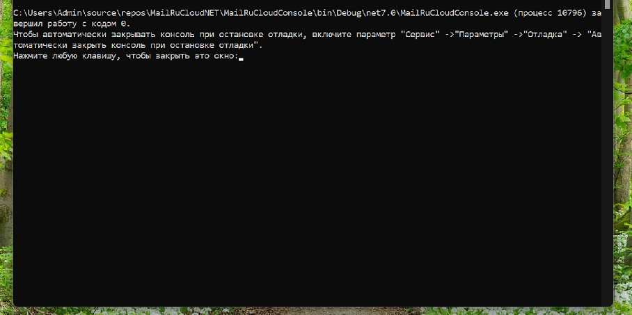

# MailRuCloudNET  / ".NET-клиент Облака Mail.Ru"

Базируется на [MailRuCloudClient.1.0.4](https://github.com/erastmorgan/Mail.Ru-.net-cloud-client) от разработчика Erast Korolev.

Исследование .NET-клиента Облака Mail.Ru (cloud.mail.ru). Штука для взаимодействия с Mail.ru Cloud через API. 
Было начато по причине устаревания cтандартного приложения Cloud Mail Ru для винфонов 
(оно тупо не даёт залогиниться, чтобы производить синхронизацию файлов и т.д.).

RU only. Только для России.

## Screenshots

## Current Status
- New version (or "iteration") with minimal improvements (some await-async bugs detected & fixed a little... or not... idk)))
- Ready .NET Targets: .NET Standard 2
- Not ready/not tested: .NET Standard 1.4 (for multi-platform deals: W10M, Android, etc.)

# Notes. Находки/Замечания
- Обнаружил какие-то непонятки-приколы с авторизацией по логину-паролю. То работало, то перестало вдруг. Связываю эти приколы с введением на сервисах на MailRu двухфакторной авторизации и повышением параноидальности и болезненности реагирования на событие "вы вошли с незнакомого места/устройсва/планеты". Лечится хз как. Наверное, где-то есть настройки по отключению "двухфактора". 
Ну и вроде бы перед экспериментами с API лучше вначале "прилогиниться к Облаку" через офиц. клиент (Android там или iOS).

## TODO
- Add .NET Standard 1.4 compatibility. Добавить совместимость с .NET Standard 1.4.
- Check&Fix All async-await routines. Разобраться с особенностями асинхронного программирования.

## References
- https://github.com/erastmorgan Erast Korolev
- https://github.com/erastmorgan/Mail.Ru-.net-cloud-client  Original Mail.Ru-.net-cloud "client" (lib, or api wrapper & tests)
- https://www.pvsm.ru/net/117611 .Net Client для облака mail.ru (Ru;  2016-04-11 в 12:49)

## .

AS IS. Как есть.

[m][e] 2022-2023

